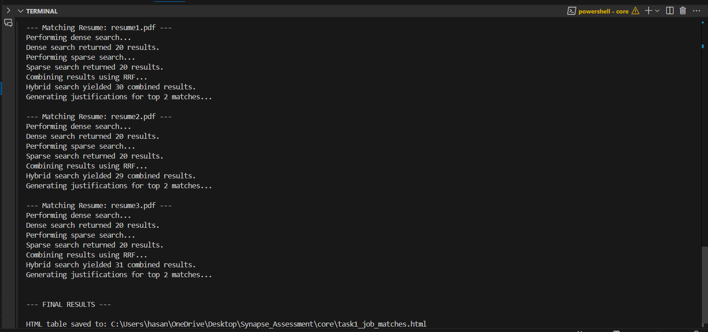
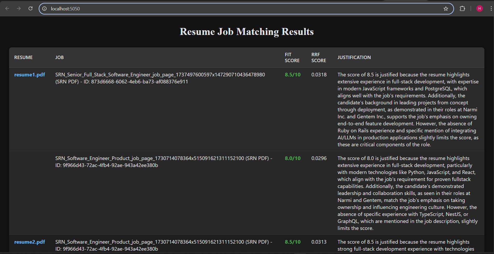
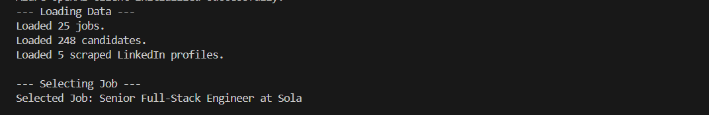
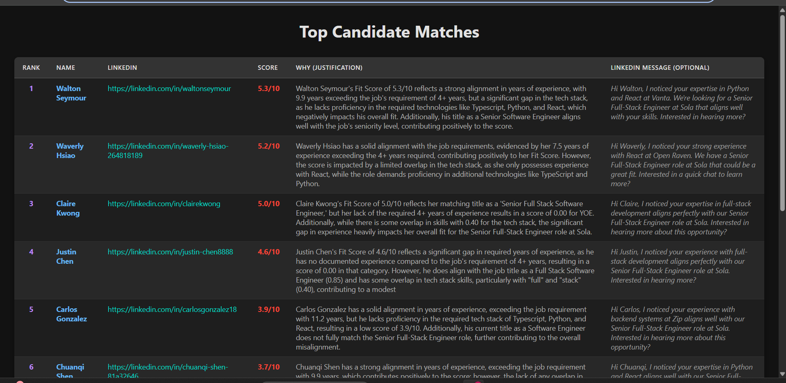

# AI Recruitment Synapse

## Overview
This project implements an AI-powered system designed to automate key recruitment tasks: matching candidate resumes to relevant job postings and matching potential candidates to specific job roles. It leverages vector databases, hybrid search techniques, and Large Language Models (LLMs) via Azure OpenAI to provide intelligent scoring and justifications.

This system was developed based on the requirements outlined in the SRN Technical Assessment for a Founding AI Engineer role.

## Directory Structure
```bash
Directory structure:
└── hasan-syed25-ai_recruitment_synapse/
    ├── README.md
    ├── requirements.txt
    ├── test.py
    ├── core/
    │   ├── clients.py
    │   ├── data_loader.py
    │   ├── html_output.py
    │   ├── justification.py
    │   ├── main_task_1.py
    │   ├── main_task_2.py
    │   ├── prompts.py
    │   └── vector_db.py
    ├── data/
    │   ├── candidates/
    │   │   ├── first_five_profiles.json
    │   │   └── JuiceboxExport_1743820890826.csv
    │   ├── jobs/
    │   │   └── Paraform_Jobs.csv
    │   └── resumes/
    ├── images/
    ├── output/
    │   ├── resume_job_matches.html
    │   └── task2_candidate_results.html
    └── utils/
        ├── helper_task_2.py
        ├── linkedin_profile_scraper.py
        ├── nltk_downloads.py
        └── scrape-pdf/

```

## Features / Tasks Implemented

### Task 1: Resume-Job Matching
**Goal:** Match multiple candidate resumes (PDFs) against a combined list of job postings from different sources (CSV and PDF).

**Inputs:**
- Directory containing candidate resumes (PDF format).
- Job postings from a CSV file (e.g., Paraform).
- Job postings from a PDF file (e.g., SRN Curated List).

**Approach:**
- **PDF Parsing:** Extracts text content from resumes and the SRN job list PDF using PyMuPDF (fitz).
- **Job Loading:** Loads job data from both CSV and parsed PDF text. Attempts to structure data from the SRN PDF based on common JD sections.
- **Indexing:** Indexes job postings into a Qdrant vector database.
- **Embeddings:** Generates dense vector embeddings for job descriptions and resumes using Azure OpenAI's text embedding models.
- **Hybrid Search:** Performs a hybrid search for each resume against the indexed jobs in Qdrant, combining:
  - Dense Search: Cosine similarity search using Azure OpenAI embeddings.
  - Sparse Search: BM25 algorithm (via rank_bm25) for keyword-based relevance.
  - Fusion: Uses Reciprocal Rank Fusion (RRF) to combine scores from dense and sparse results.
- **Scoring & Justification:** Ranks jobs based on the combined RRF score, converts it to a 1-10 fit score, and uses an Azure OpenAI Chat Model (e.g., GPT-3.5 Turbo or GPT-4) to generate a brief justification for the top matches.
- **Output:** Prints the top 2 job matches for each resume, including the job identifier, fit score, and AI-generated justification. (Note: The current script prints to console; HTML output similar to Task 2 could be added).

### Task 2: Job-Candidate Matching
**Goal:** Identify the best-fit candidates from a provided list (CSV) for a single, randomly selected job posting. Enhance candidate profiles using scraped LinkedIn data.

**Inputs:**
- Job postings CSV file (e.g., Paraform).
- Candidate list CSV file (e.g., Juicebox Export).
- JSON file containing scraped LinkedIn profile data (e.g., from Proxycurl) for a subset of candidates.

**Approach:**
- **Job Selection:** Randomly selects one job from the jobs CSV.
- **Candidate Loading:** Loads the candidate list from the CSV.
- **LinkedIn Data Enhancement:** Loads the scraped LinkedIn data (JSON). Matches scraped profiles to candidates in the CSV (primarily via LinkedIn URL) to create enhanced profiles containing richer information like work experiences, skills, headlines, etc. Candidates without scraped data are processed using only the information from the CSV.
- **Feature Extraction:** Calculates/extracts key features for each candidate:
  - Years of Experience (YOE): Calculated from LinkedIn work history.
  - Job Hopping: Heuristic check based on tenure duration from LinkedIn data.
  - Skills: Extracted from LinkedIn profile sections (skills, headline, summary, experiences) and Juicebox title.
  - Startup Fit: Heuristic assessment based on candidate's company history (from LinkedIn) compared to job context.
- **Weighted Scoring:** Scores each candidate against the selected job using a weighted combination of:
  - Title Match (using fuzzy matching via thefuzz).
  - YOE Match (comparing candidate YOE vs. job requirement).
  - Tech Stack Match (keyword overlap between candidate skills and job requirements/tech stack).
  - Startup Fit Score.
  - Tenure Penalty (if job hopping detected).
- **Ranking & Justification:** Ranks candidates based on their final score (scaled 1-10). Uses an Azure OpenAI Chat Model to generate a justification ("Why") for the fit of the top 5-10 candidates.
- **Outreach Message (Optional):** Generates a concise, personalized LinkedIn outreach message draft for the top candidates using the Azure OpenAI Chat Model.
- **Output:** Saves a ranked table of the top 5-10 candidates to an HTML file (task2_candidate_results.html). The table includes Rank, Name, LinkedIn URL, Score, Justification, and the optional LinkedIn message draft, styled with a dark theme.

## Technology Stack
- **Language:** Python 3.x
- **AI/LLM:** Azure OpenAI Service (Text Embeddings, Chat Completion Models like GPT-4o-mini)
- **Vector Database:** Qdrant (for Task 1 Hybrid Search)
- **Search Algorithms:** Cosine Similarity (Dense), BM25 (Sparse), Reciprocal Rank Fusion (RRF)
- **Data Handling:** Pandas
- **PDF Parsing:** PyMuPDF (fitz)
- **Fuzzy Matching:** thefuzz, python-Levenshtein
- **NLP Toolkit:** NLTK (for tokenization, stopwords)
- **Environment Management:** python-dotenv
- **LinkedIn Scraping (Data Source):** Proxycurl (as mentioned by user - Note: Code performs enhancement using provided JSON, does not perform live scraping)

## Setup and Installation

### Prerequisites:
- Python (version 3.8 or higher recommended).
- Git.
- A running Qdrant instance (for Task 1). You can easily run one using Docker or use cloud:

```
using docker cloud (free cluster)
```

### Clone Repository:
```
git clone <your-repository-url>
cd <repository-directory-name> # e.g., cd ai-recruitment-matcher
```

### Create Virtual Environment (Recommended):
```
python -m venv venv
# Activate the environment
# Windows:
venv\Scripts\activate
# macOS/Linux:
source venv/bin/activate
```

### Install Dependencies:
```
pip install -r requirements.txt
```

(Ensure requirements.txt includes: pandas, openai, python-dotenv, qdrant-client, rank_bm25, PyMuPDF, thefuzz, python-Levenshtein, nltk)

### Download NLTK Data:
Run the following Python code once to download necessary NLTK packages:

```python
import nltk
nltk.download('punkt')
nltk.download('stopwords')
```

### Configure Environment Variables:
1. Create a file named `.env` in the root directory of the project.
2. Add your Azure OpenAI credentials to this file. Use `.env.example` as a template:

```
# .env.example - Copy this to .env and fill in your values

AZURE_OPENAI_API_KEY=""
AZURE_OPENAI_API_VERSION=""
AZURE_OPENAI_ENDPOINT=""
AZURE_OPENAI_CHAT_DEPLOYMENT_NAME=""
AZURE_OPENAI_EMBEDDING_ENDPOINT=""
AZURE_OPENAI_EMBEDDING_DEPLOYMENT_NAME=""
EMBEDDING_CLIENT_API_KEY=""
PROXY_CURL_API_KEY=""
QDRANT_URL=""
QDRANT_API_KEY=""
```

**Important:** Ensure the model deployment names match exactly those deployed in your Azure OpenAI resource.

## How to Run

### Update File Paths:
Before running, open the Python scripts (e.g., task_1_main.py, task_2_main.py - adjust script names as needed) and update the placeholder file paths for your input data (resumes, job CSVs, candidate CSV, LinkedIn JSON) near the top of each script. Example placeholders:

```python
# --- Placeholder File Paths - **UPDATE THESE** ---
RESUME_DIR = 'path/to/your/resumes/' # Task 1
PARA_JOB_CSV = 'path/to/your/paraform_jobs.csv' # Task 1 & 2
SRN_JOB_PDF = 'path/to/your/srn_curated_list.pdf' # Task 1
CANDIDATE_CSV = 'path/to/your/juicebox_candidates.csv' # Task 2
LINKEDIN_JSON = 'path/to/your/linkedin_profiles.json' # Task 2
OUTPUT_HTML_FILE = 'task2_candidate_results.html' # Task 2 Output
# --- End Placeholder File Paths ---
```

### Activate Virtual Environment:
```
# Windows: venv\Scripts\activate
# macOS/Linux: source venv/bin/activate
```

### Run Task 1 Script:
```
python task_1_main.py # Or your script name for Task 1
```
(The first run will index jobs into Qdrant if the collection is empty)

### Run Task 2 Script:
```
python task_2_main.py # Or your script name for Task 2
```

## Outputs
- **Task 1:** Prints the matching results (top 2 jobs per resume with scores and justifications) directly to the console.
  



- **Task 2:** Generates an HTML file named task2_candidate_results.html in the project's root directory. This file contains a styled table listing the top 5-10 matched candidates, their scores, justifications, and optional LinkedIn outreach messages.
  





## LinkedIn Data & Scraping Note
This project utilizes pre-scraped LinkedIn data (provided in a JSON file, assumed to be obtained via tools like Proxycurl) to enhance candidate profiles for Task 2 matching. This enhancement is crucial because the scraped data typically contains far richer information than standard CSV exports, such as detailed work experience history (allowing for YOE and tenure calculations), comprehensive skill lists, profile summaries, and headlines. Accessing this richer data significantly improves the quality and accuracy of the candidate-job matching scores, particularly for criteria like tech stack alignment, YOE validation, and startup fit assessment.

For candidates in the input CSV where corresponding scraped data is not available in the provided JSON file, the system defaults to using only the limited information present in the CSV (like name, current title, location). This effectively simulates a real-world scenario where complete, up-to-date profile information might not be accessible for every potential candidate, demonstrating the system's ability to function with varying levels of data richness.
